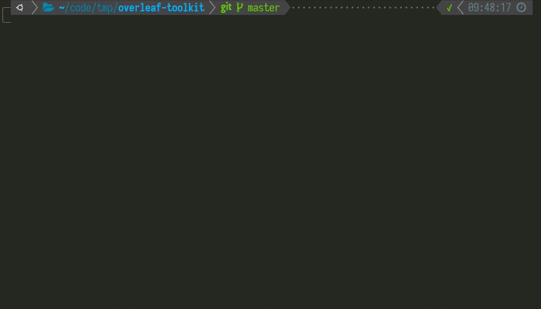

# OverLeaf

>[官方代码仓库](https://github.com/overleaf/overleaf/)
>
>[官方工具包](https://github.com/overleaf/toolkit/)
>
>[官方新版教程](https://github.com/overleaf/toolkit/blob/master/doc/quick-start-guide.md)：采用自动化脚本部署，对安装部分较为详细
>
>[官方老版教程](https://github.com/overleaf/toolkit/blob/master/doc/quick-start-guide.md)：单独拉取镜像，并对安装后的管理员有所设置
>
>参考博客：
>
>- https://www.jianshu.com/p/549901fe73a5
>- https://www.zhihu.com/question/62943097/answer/2217087254
>- https://www.ivdone.cn/article/292.html
>- https://evanzj.com/2020/02/04/ShareLatexDocker/
>- https://lisz.me/tech/docker/sharelatex.html

## 介绍


## 安装

1. 安装docker

2. 安装docker-compose

3. 下载overleaf toolkit启动脚本包：

   ```shell
   git clone https://github.com/overleaf/toolkit.git ./overleaf
   ```

   下载好后，`overleaf`文件夹下有`doc`文件夹，内部为此版本的官方脚本教程，可以优先参考

   ```shell
   # 以下为overleaf/doc的目录结构
   .
   ├── ce-upgrading-texlive.md
   ├── configuration.md
   ├── dependencies.md
   ├── docker-compose.md
   ├── getting-server-pro.md
   ├── img
   │   └── upgrade-demo.gif
   ├── ldap.md
   ├── overleaf-rc.md
   ├── overview.md
   ├── persistent-data.md
   ├── quick-start-guide.md
   ├── README.md
   ├── saml.md
   ├── sandboxed-compiles.md
   ├── the-doctor.md
   ├── tls-proxy.md
   └── upgrading.md
   ```

4. 初始化配置文件：

   ```shell
   cd ~/overleaf
   # 不需要TLS连接
   ./bin/init
   # 如果需要TLS连接则执行
   ./bin/init --tls
   ```

   如果不能执行脚本，可能是由于没有执行权限造成的，可以添加权限：

   ```shell
   cd ~/overleaf/bin
   chmod +x *
   ```

   初始化后所有配置文件复制到了`overleaf/config`文件夹中，应该包含：

   1. `overleaf.rc`：启动镜像的脚本所需的各种配置文件
   2. `variables.env`：添加到docker容器中的环境变量
   3. `version`：使用的docker镜像版本
   3. `nginx`文件夹：所有TLS相关的证书等配置

5. 修改配置文件：

   1. 修改overleaf.rc：
      打开`config/overleaf.rc`之后：

      ```shell
      #### Overleaf RC ####
      # 可以修改为自己想要的名字
      PROJECT_NAME=overleaf
      
      # Sharelatex container
      SHARELATEX_DATA_PATH=data/sharelatex
      SERVER_PRO=false
      # 修改为最终浏览器访问时输入的hostname，如果不确定可以直接使用0.0.0.0监听所有连接
      SHARELATEX_LISTEN_IP=0.0.0.0
      # 默认HTTP采用80端口，如果有需要可以采用其他端口
      SHARELATEX_PORT=80
      
      # Sibling Containers
      SIBLING_CONTAINERS_ENABLED=false
      DOCKER_SOCKET_PATH=/var/run/docker.sock
      
      # Mongo configuration
      MONGO_ENABLED=true
      MONGO_DATA_PATH=data/mongo
      
      # Redis configuration
      REDIS_ENABLED=true
      REDIS_DATA_PATH=data/redis
      
      # TLS proxy configuration (optional)
      # See documentation in doc/tls-proxy.md
      # 如果不需要开启TLS则NGINX_ENABLED需要设置为false，否则会检查配置文件及证书等
      NGINX_ENABLED=false
      NGINX_CONFIG_PATH=config/nginx/nginx.conf
      # 修改为NGINX需要使用的PORT
      NGINX_HTTP_PORT=80
      # 修改为NGINX需要监听的IP，注意NGINX监听的IP与Port不能与SHARELATEX监听的IP和Port完全一致
      NGINX_HTTP_LISTEN_IP=127.0.1.1
      NGINX_TLS_LISTEN_IP=127.0.1.1
      
      TLS_PRIVATE_KEY_PATH=config/nginx/certs/overleaf_key.pem
      TLS_CERTIFICATE_PATH=config/nginx/certs/overleaf_certificate.pem
      TLS_PORT=443
      ```

      其中主要修改`SHARELATEX_LISTEN_IP`以及`SHARELATEX_PORT`为外部访问当前主机需要的host和port

      如果需要使用Nginx容器，则先要部署Nginx的证书等，然后再对以上文件的NGINX部分进行配置

   2. <span id="env">修改variables.env</span>

      打开`config/variables.env`之后：

      ```shell
      SHARELATEX_APP_NAME=Our Overleaf Instance
      
      ENABLED_LINKED_FILE_TYPES=project_file,project_output_file
      
      # Enables Thumbnail generation using ImageMagick
      ENABLE_CONVERSIONS=true
      
      # Disables email confirmation requirement
      EMAIL_CONFIRMATION_DISABLED=true
      
      # temporary fix for LuaLaTex compiles
      # see https://github.com/overleaf/overleaf/issues/695
      TEXMFVAR=/var/lib/sharelatex/tmp/texmf-var
      
      ## Nginx
      # NGINX_WORKER_PROCESSES=4
      # NGINX_WORKER_CONNECTIONS=768
      
      ## Set for TLS via nginx-proxy
      # SHARELATEX_BEHIND_PROXY=true
      # SHARELATEX_SECURE_COOKIE=true
      # 可以修改为自己设置的网站地址，用于后续发放修改密码等连接使用
      SHARELATEX_SITE_URL=http://overleaf.example.com
      SHARELATEX_NAV_TITLE=Our Overleaf Instance
      # SHARELATEX_HEADER_IMAGE_URL=http://somewhere.com/mylogo.png
      # SHARELATEX_ADMIN_EMAIL=support@example.com
      
      # SHARELATEX_LEFT_FOOTER=[{"text":"Powered by Overleaf © 2021", "url": "https://www.overleaf.com"}, {"text": "Contact your support team", "url": "mailto:support@example.com"} ]
      # SHARELATEX_RIGHT_FOOTER=[{"text":"Hello I am on the Right"}]
      
      # SHARELATEX_EMAIL_FROM_ADDRESS=team@example.com
      
      # SHARELATEX_EMAIL_AWS_SES_ACCESS_KEY_ID=
      # SHARELATEX_EMAIL_AWS_SES_SECRET_KEY=
      
      # SHARELATEX_EMAIL_SMTP_HOST=smtp.example.com
      # SHARELATEX_EMAIL_SMTP_PORT=587
      # SHARELATEX_EMAIL_SMTP_SECURE=false
      # SHARELATEX_EMAIL_SMTP_USER=
      # SHARELATEX_EMAIL_SMTP_PASS=
      # SHARELATEX_EMAIL_SMTP_NAME=
      # SHARELATEX_EMAIL_SMTP_LOGGER=false
      # SHARELATEX_EMAIL_SMTP_TLS_REJECT_UNAUTH=true
      # SHARELATEX_EMAIL_SMTP_IGNORE_TLS=false
      # SHARELATEX_CUSTOM_EMAIL_FOOTER=This system is run by department x
      
      
      TEX_LIVE_DOCKER_IMAGE=quay.io/sharelatex/texlive-full:2020.1
      ALL_TEX_LIVE_DOCKER_IMAGES=quay.io/sharelatex/texlive-full:2020.1,quay.io/sharelatex/texlive-full:2019.1
      ```

      可以修改`SHARELATEX_SITE_URL`为自己的网站地址，为了后续发放修改密码等链接来进行使用，否则overleaf的网站实例生成URL时会使用`localhost`且不会有端口号，需要在输入链接时自己补全所有的host以及port

6. <span id="start-container">启动镜像</span>：

   ```shell
   # 容器日志输出到标准输出上
   ~/overleaf/bin/up
   # 不输出日志，在后台运行
   ~/overleaf/bin/up -d
   ```

   `bin/up`脚本有创建容器(如果当前容器不存在)功能，创建后若使用`CTRL-C`停止，容器依旧存在，但并不运行。

   容器采用`bin/start`的脚本启动时，只是对停止的容器进行启动，并在后台运行，若未创建容器则启动失败。

   如果仍然有需要也可以采用`bin/docker-compose`的方式来直接对docker进行控制。

7. 到此就可以进入界面，但此时的容器仍然为精简版，因此需要更新：

   1. 查看当前容器的tlmgr版本及设置：

      ```shell
      # sharelatex 可以根据需要调整为当前使用的容器名
      # 查看tlmgr版本
      docker exec sharelatex tlmgr --version
      # 查看当前tlmgr设置
      docker exec sharelatex tlmgr option
      ```

   2. 如果网络环境不好，需要更换源，则：

      ```shell
      # sharelatex为当前容器名，以清华源为示例，可以更换其他源
      docker exec sharelatex tlmgr option repository https://mirrors.tuna.tsinghua.edu.cn/CTAN/systems/texlive/tlnet
      ```

   3. 进行自更新及安装完整版：

      ```shell
      # sharelatex 可以根据需要调整为当前使用的容器名
      docker exec sharelatex tlmgr update --self --all
      docker exec sharelatex tlmgr install tikzlings tikzmarmots tikzducks
      docker exec sharelatex tlmgr install scheme-full
      ```

      

8. 补全中文字体(如果不需要可以跳过)：

   1. 上传本地中文字体库，以windows为例，打开`C:\Windows\Fonts`文件夹，将其上传到服务器`~/fonts`文件夹中：

      1. 可以使用mobaxterm自带的上传文件功能

      2. 可以使用windows中的scp功能：

         ```sh
         scp.exe -r C:\Windows\Fonts ${user}@${ip}:~/windowsfonts
         ```

   2. 在服务器中处理字体

      ```shell
      # 进入刚上传到的文件夹中
      cd ~/fonts
      # 删掉.fon字体，因为这种字体建立目录时可能报错，尽量只留.ttf和.otf格式的字体
      # 如果只想上传少量特定的字体，也可以其他都删掉，只留要放进docker的即可
      rm -r *.fon
      cd ..
      # 由于docker只能单文件copy，所以需要打包
      tar -zcvf windowsfonts.tar.gz windowsfonts/
      # 传入当前运行的docker容器的root目录，sharelatex为容器名，可根据目前实际容器名进行调整
      docker cp windowsfonts.tar.gz sharelatex:/root
      ```

   3. 容器中安装字体：

      ```shell
      # 进入sharelatex容器
      docker exec -it sharelatex bash
      # 安装wqy字体同时安装xfont工具
      apt update && apt upgrade
      apt install xfonts-wqy
      # 将上传的字体放入系统字体
      cd /root
      tar -zxvf windowsfonts.tar.gz
      mv windowsfonts /usr/share/fonts
      # 安装新的系统字体
      cd /usr/share/fonts/windowsfonts
      mkfontscale
      mkfontdir
      fc-cache -fv
      # 检查安装结果
      fc-list :lang=zh-cn
      ```

      

9. 根据需要可以保存完整版为新镜像：

   ```shell
   docker commit sharelatex sharelatex/sharelatex:with-texlive-full
   ```

   如果需要使用新镜像创建容器，则需要新添加`lib/docker-compose.override.yml`：

   ```yaml
   ---
   # verison需要与docker-compose.base.yml中一致
   version: '2.2'
   services:
       sharelatex:
           image: sharelatex/sharelatex:with-texlive-full
   ```

10. 可以重启镜像进行使用了：

   ```shell
   bin/stop
   bin/start
   ```

   如果需要删除原来创建的`sharelatex`容器，则可以在`overleaf`文件夹路径下执行：

   ```shell
   bin/docker-compose rm -f sharelatex
   ```

   

## 使用

### 更新

在`overleaf`文件夹执行`/bin/upgrade`并跟随命令行提示进行操作

需要注意的是upgrade时脚本会检测当前的docker镜像版本，如果有新版本则会询问是否替换，替换过后会生成`config/__old-version`文件，留作副本。

另外替换完新版本会询问是否停止当前容器，并启动新容器。此时可以取消这一步手动停止并备份文件等；也可以继续，并将停止的原容器中需要的数据导出。

过程大致如下：



### 配置管理员

1. 网页配置：

   1. 浏览器中打开`http://your-domain/launchpad`，根据自己的配置可以使用https协议，以及修改`your-domain`为自己服务器的ip+port或域名
   2. 填入管理员的用户名密码，进行注册
   3. 注册成功登录后就会显示成为管理员了

2. 进入docker的容器进行配置：

   1. 执行增添管理员的命令

      ```shell
      # 其中exec后面填入的为容器名，一般第一次修改时为sharelatex，如果有需要请填写当前需要进入的容器名
      # 请将create-admin中${your_admin}改为正确的邮箱用户名，example.com改为正确的邮箱域名
      docker exec sharelatex /bin/bash -c "cd /var/www/sharelatex; grunt user:create-admin --email=${your_admin}@example.com"
      ```

   2. 填写密码：
      docker容器会执行指令并最终返回一个URL用来设置刚刚创建的管理员密码，打开URL并填写密码，若URLhostname等设置有误，请参考[variable设置](#env)

   

### 用户管理

#### 添加

1. 完成[管理员配置](# 配置管理员)
2. 使用管理员身份登录`http://your-domain/admin/register`进行成员添加，其中your-domain为真实使用的ip地址或域名

#### 删除

```shell
docker exec sharelatex /bin/bash -c "cd /var/www/sharelatex; grunt user:delete --email=${delete_user}@example.com"
```

#### 查看

```shell
# 进入数据库
sudo docker exec -it mongo bash
# 列出sharelatex的用户
mongoexport -d sharelatex -c users -f email
```


### 升级为Server Pro版本

`Sharelatex Server Pro`是对`Sharelatex-CE`版本的升级，采用了不同的镜像源地址来区分两个版本，升级步骤如下：

1. 获取资格：

   1. 先查看不同版本与部署方式的[功能对比](https://www.overleaf.com/for/enterprises/features)，确定自己需要Pro资格
   2. 联系overleaf官方：直接向[welcome@overleaf.com](mailto:welcome@overleaf.com)发送邮件或在[Contact Us](https://www.overleaf.com/contact)页面留言
   3. 根据官方的回复进行购买或协商
   4. 最终如果购买成功则可以得到官方发放的`key-name`和`key`，作为获取镜像的密钥

2. 修改配置文件：

   对`config/overleaf.rc`的`SERVER_PRO`变量进行修改：

   ```shell
   SERVER_PRO=true
   ```

3. 登录镜像仓库：
   `Server Pro`版本的docker镜像发布在了[quay.io](https://quay.io)仓库，地址为`quay.io/sharelatex/sharelatex-pro`

   用overleaf官方发放的密钥登录仓库:

   ```shell
   docker login quay.io
   # 将your_key_name换成官方发放名称
   Username: <sharelatex+your_key_name>
   # 将your_key换成官方发放的密钥
   Password: <your_key>
   ```

   登录后docker会保留密钥凭据到`/home/${USER}/.docker/config.json`中，下次可以免密登录

   此时可以进行执行`bin/docker-compose pull`镜像拉取，验证镜像是否准确并且有权限获取，也可以直接执行下一步启动容器

4. docker启动容器：

   与普通版本正常[启动镜像](#start-container)一致，输入`bin/up -d`进行启动即可，后续步骤也可参考普通版本[安装步骤](#安装)

### 配置LDAP

> 参考：
>
> - <https://github-wiki-see.page/m/overleaf/overleaf/wiki/Server-Pro:-LDAP-Config>
> - <https://github.com/smhaller/ldap-overleaf-sl>
> - <https://github.com/worksasintended/overleaf_ldap>
> - <https://github.com/overleaf/toolkit/blob/master/doc/ldap.md>
> - <https://github.com/overleaf/overleaf/wiki/Server-Pro%3A-LDAP-Config>

###### 注意：自己部署的sharelatex先要[**升级为Server Pro版本**](#升级为Server Pro版本)才能够配置LDAP，进行统一账号认证！

在`variables.env`中配置环境变量：

#### 环境变量说明

|                    变量名                    |                             说明                             |                 示例                 |
| :------------------------------------------: | :----------------------------------------------------------: | :----------------------------------: |
|             SHARELATEX_LDAP_URL              |                       LDAP服务器的URL                        |     ldaps://ldap.example.com:636     |
|          SHARELATEX_LDAP_EMAIL_ATT           |          LDAP服务器中代表邮箱的字段名，默认为`mail`          |                 mail                 |
|           SHARELATEX_LDAP_NAME_ATT           |   LDAP服务器中代表用户名的字段名，用作overleaf中显示的名称   |                  cn                  |
|        SHARELATEX_LDAP_LAST_NAME_ATT         |                 LDAP服务器中代表姓氏的字段名                 |                  sn                  |
|         SHARELATEX_LDAP_PLACEHOLDER          |                 登录填写表单中默认的占位名称                 |               Username               |
| SHARELATEX_LDAP_UPDATE_USER_DETAILS_ON_LOGIN | 设置为`true`代表每次登录通过LDAP去验证，用户不能通过overleaf实例修改自身信息；设置为`false`代表第一次登录通过LDAP导入信息到本地overleaf实例的数据库进行管理 |                 true                 |
|           SHARELATEX_LDAP_BIND_DN            |                   登录LDAP服务器绑定的DN名                   | uid=admin,ou=users,dc=example,dc=com |
|       SHARELATEX_LDAP_BIND_CREDENTIALS       |                        绑定DN名的密码                        |               password               |
|        SHARELATEX_LDAP_BIND_PROPERTY         |          LDAP服务器代表用户信息的字段名，默认为`dn`          |                  dn                  |
|         SHARELATEX_LDAP_SEARCH_BASE          |                     进行查找检索的DN条目                     |      ou=users,dc=example,dc=com      |
|        SHARELATEX_LDAP_SEARCH_FILTER         |                        LDAP 查询条件                         |          (uid={{username}})          |
|         SHARELATEX_LDAP_SEARCH_SCOPE         |                   查询范围，默认值为`sub`                    |         必须为base或one或sub         |
|      SHARELATEX_LDAP_SEARCH_ATTRIBUTES       | Optional, default all. Json array of attributes to fetch from LDAP server. |                                      |
|      SHARELATEX_LDAP_GROUP_DN_PROPERTY       | Optional, default 'dn'. The property of user object to use in '{{dn}}' interpolation of groupSearchFilter. |                                      |
|      SHARELATEX_LDAP_GROUP_SEARCH_BASE       | Optional. The base DN from which to search for groups. If defined, also groupSearchFilter must be defined for the search to work |                                      |
|      SHARELATEX_LDAP_GROUP_SEARCH_SCOPE      |                   Optional, default 'sub'                    |                                      |
|     SHARELATEX_LDAP_GROUP_SEARCH_FILTER      | Optional. LDAP search filter for groups. The following literals are interpolated from the found user object: '{{dn}}' the property configured with groupDnProperty. Optionally you can also assign a function instead, which passes a user object, from this a dynamic groupsearchfilter can be retrieved |                                      |
|   SHARELATEX_LDAP_GROUP_SEARCH_ATTRIBUTES    | Optional, default all. Json array of attributes to fetch from LDAP server. |                                      |
|            SHARELATEX_LDAP_CACHE             | 是否对LDAP认证信息进行缓存，默认为`true`（对最多100条记录进行5分钟的缓存） |                 true                 |
|           SHARELATEX_LDAP_TIMEOUT            |          客户端不进行操作之后的超时时间，默认为无穷          |                 600                  |
|       SHARELATEX_LDAP_CONNECT_TIMEOUT        |        客户端TCP重连时间，默认值为系统设置的重连时间         |                  10                  |
|       SHARELATEX_LDAP_TLS_OPTS_CA_PATH       | 以JSON数组形式填入TLS认证的证书路径，且保证在docker容器中可以访问到 |   ["/var/one.pem", "/var/two.pem"]   |
|    SHARELATEX_LDAP_TLS_OPTS_REJECT_UNAUTH    |          设置为`true`则强制根据提供的CA列表验证证书          |                 true                 |


### 配置SMTP

>参考：
>
>- https://github.com/overleaf/overleaf/wiki/Configuring-SMTP-Email

##### Sender Configuration

- `SHARELATEX_EMAIL_FROM_ADDRESS`: **REQUIRED** - The from address e.g. `'support@mycompany.com'`
- `SHARELATEX_EMAIL_REPLY_TO`: The reply to address e.g. `'noreply@mycompany.com'`

##### AWS SES

- `SHARELATEX_EMAIL_AWS_SES_ACCESS_KEY_ID`: If using AWS SES the access key
- `SHARELATEX_EMAIL_AWS_SES_SECRET_KEY`: If using AWS SES the secret key
- SHARELATEX_EMAIL_AWS_SES_REGION

##### AWS SES with Instance Roles

- `SHARELATEX_EMAIL_DRIVER`: When this is set to `ses`, the email system will rely on the configured instance roles to send email.

##### SMTP

- `SHARELATEX_EMAIL_SMTP_HOST`: SMTP Host, needs to be accessible from the docker container
- `SHARELATEX_EMAIL_SMTP_PORT`: SMTP port to use
- `SHARELATEX_EMAIL_SMTP_SECURE`: Boolean if SMTP secure should be used
- `SHARELATEX_EMAIL_SMTP_USER`: User to authenticate against the STMP server with
- `SHARELATEX_EMAIL_SMTP_PASS`: Password for SMTP User
- `SHARELATEX_EMAIL_SMTP_TLS_REJECT_UNAUTH`: Rejected unauthorized tls connections
- `SHARELATEX_EMAIL_SMTP_IGNORE_TLS`: turns off STARTTLS support if true
- `SHARELATEX_EMAIL_SMTP_NAME`: optional hostname of the client, used for identifying to the server, defaults to hostname of the machine.
- `SHARELATEX_EMAIL_SMTP_LOGGER`: when set to `true` prints logging messages to `web.log`.
- SHARELATEX_EMAIL_TEXT_ENCODING

#### Customisation

- `SHARELATEX_CUSTOM_EMAIL_FOOTER` Custom HTML which is appended to all emails. e.g. `--env SHARELATEX_CUSTOM_EMAIL_FOOTER="<div>This system is run by department x </div> <div> If you have any questions please look at our faq <a href='https://somwhere.com'>here</a></div>"`